[Link to page](https://midas-lotto-a19d21e3453e.herokuapp.com/)

# Midas Lotto

Midas Lotto is a web application designed to manage a workplace lottery system.  
It allows users to subscribe to monthly draws, track winnings, interact via comments, and securely pay using Stripe.

## Live Project

- Live Site: https://midas-lotto-a19d21e3453e.herokuapp.com/
- Repository: https://github.com/EmcioN/Midas-lotto

## Table of Contents
[UX](#ux)  
* [Goal for the Project](#goal-for-the-project)  
* [User Goals](#user-goals)  
* [User Stories](#user-stories)  
* [Site Owner Goals](#site-owner-goals)  
* [Design Choices](#design-choices)  
  * [Font](#font)  
  * [Icons](#icons)  
  * [Colours](#colours)  
  * [Structure](#structure)  
  * [Project Structure](#project-structure)  
  * [Wireframes](#wireframes)
  * [Data Schema](#data-schema)  
* [Features](#features)  
* [Future Plans](#future-plans)
* [Testing](#testing)  
* [Technologies Used](#technologies-used)  
  * [Languages](#languages)  
  * [Frameworks and Libraries](#frameworks-and-libraries)  
  * [Tools](#tools)    
* [Deployment](#deployment)  
* [Credits](#credits)

## Goal for the Project

The goal of Midas Lotto is to create a centralized, easy-to-use platform for managing a shared lottery system in a workplace environment.  
It replaces manual tracking and improves transparency, engagement, and fairness.

## User Goals

Users of Midas Lotto want to:

- Register and log in securely
- View the current lotto draw and latest results
- See past draws and total winnings
- Join the lotto subscription easily
- Pay securely for their subscription

## User Stories

- As a user, I want to register an account so that I can join the lotto.
- As a user, I want to log in so that I can access my profile and subscriptions.
- As a user, I want to view the current draw so I can see the latest results.
- As a user, I want to view all draws so that I can check past results and winnings.
- As a user, I want to view a single draw in detail so I can see results, images, and comments.
- As a user, I want to comment on a draw so that I can share my thoughts with others.
- As a user, I want to join the current month subscription so that I can participate in the lotto.
- As a user, I want to pay for my subscription securely so that my payment is handled safely.

### Site Owner Goals

The site owner wants to:
- Provide a clear and transparent lottery system for all users  
- Manage monthly draws and results efficiently  
- Automate subscription handling and reduce manual work  
- Ensure secure and reliable payment processing  
- Keep accurate records of winnings and subscriptions

## Design Choices

### Font
The application uses default system and Bootstrap fonts.  
These were chosen to ensure:
- High readability  
- Accessibility across devices  
- Consistent appearance without external dependencies  

---

### Icons
Minimal use of icons is applied throughout the interface to:
- Keep the design clean and uncluttered  
- Support navigation where needed  
- Maintain focus on content rather than decoration  

---

### Colours
The project uses a dark theme with gold accents to:
- Create a premium, lottery-inspired look  
- Improve contrast and readability  
- Highlight important information such as winnings and actions  

Primary colours:
- Gold (#d4af37) for highlights and buttons  
- Dark background for contrast  
- White text for clarity

### Structure
The application is structured around a clear user flow:
- Authentication (register, login, logout)  
- Homepage overview (current draw and winnings)  
- Draw list and draw detail views  
- Subscription and payment flow  
- Profile management  

Navigation is consistent across all pages using a fixed navbar.

---

### Login Page

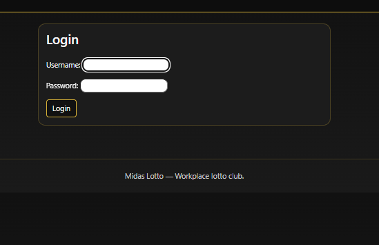

---

### Register Page

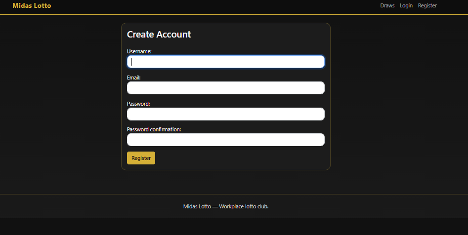

---

### Homepage


---

### Draw List Page

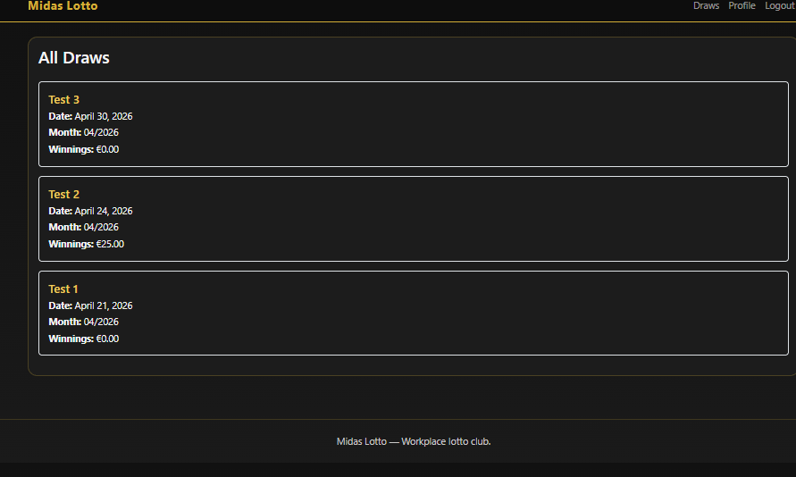

---

### Draw Detail Page

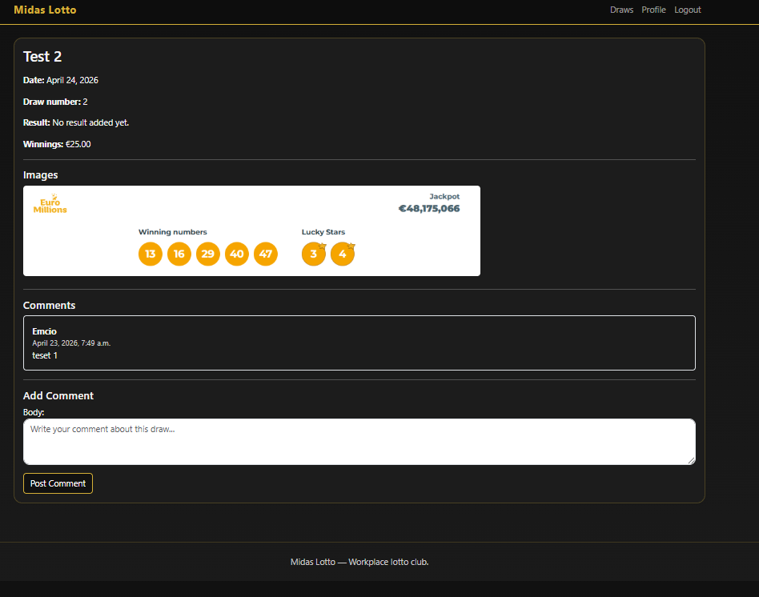

---

### Comment Section

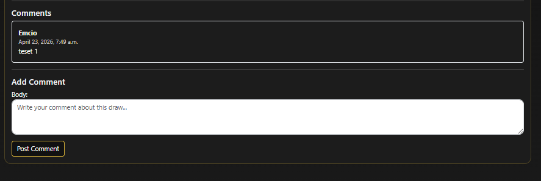

---

### Subscription Page

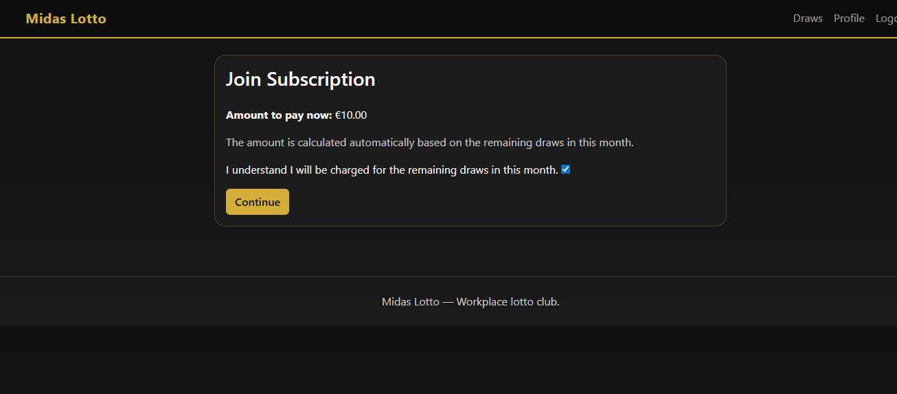

---

### Stripe Checkout

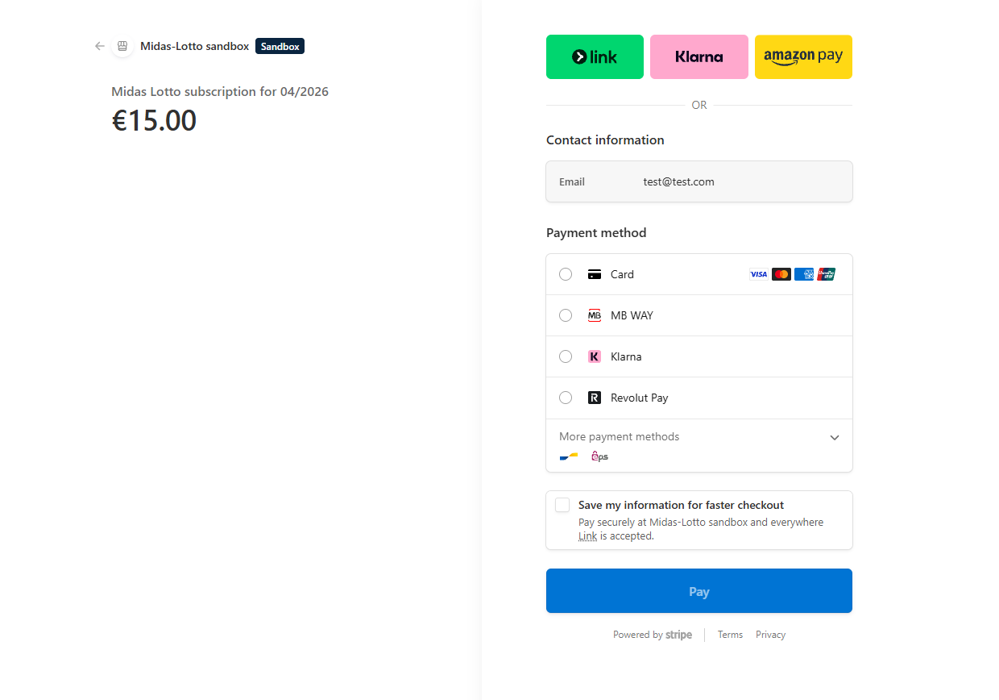

---

### Payment Success Page

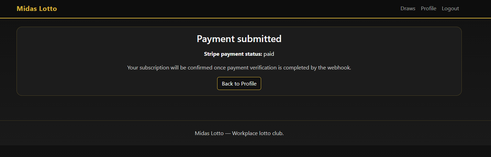

---

### Payment Cancel Page

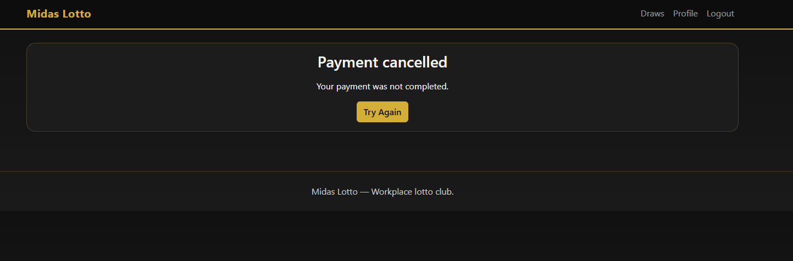

---

### Profile Page

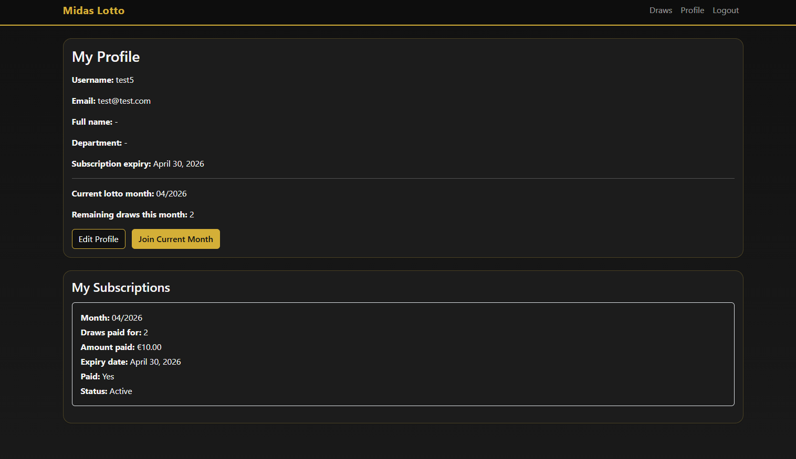

---

### Edit Profile Page

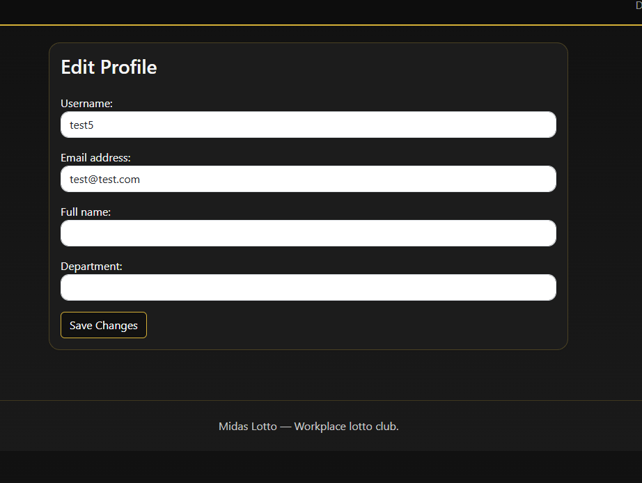

---

### Admin Panel

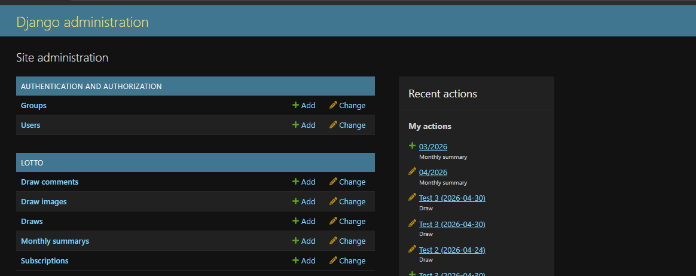

---

### Project Structure

Midas-Lotto/

├── accounts/ - Authentication and user profiles  
├── core/ - Homepage and base views  
├── lotto/ - Lotto system (draws, subscriptions, comments)  
├── media/ - Uploaded images  
├── static/ - CSS and static files  
├── templates/ - HTML templates  
├── config/ - Project configuration  
├── manage.py  
└── requirements.txt  

---

## Wireframes

The following wireframes were created during the planning stage.

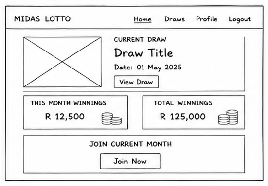

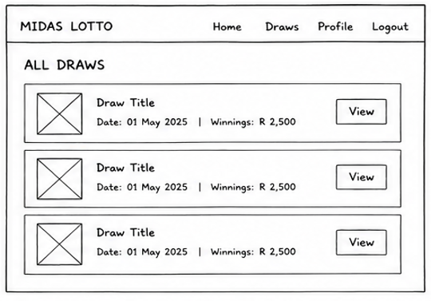

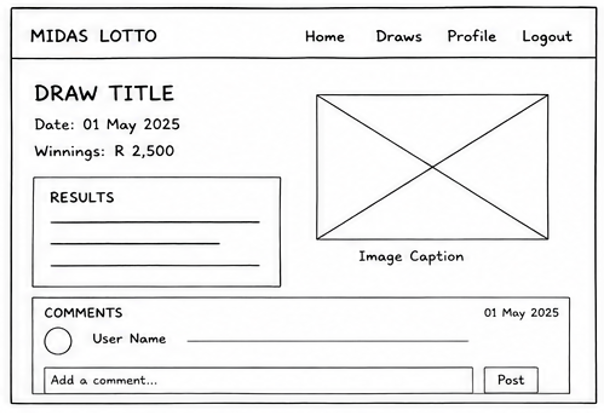

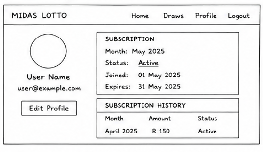

---

## Data Schema

The application uses a relational PostgreSQL database with Django ORM models.

### User
Django’s built-in User model handles authentication.

Relationships:
- One User can have one Profile.
- One User can create many Comments.
- One User can have many Subscriptions.

### Draw
Stores each lottery draw.

Fields include:
- title
- draw date
- result
- winnings
- current draw status

Relationships:
- One Draw can have many Comments.
- One Draw can have many Draw Images.

### Comment
Stores user comments on draw detail pages.

Relationships:
- Each Comment belongs to one User.
- Each Comment belongs to one Draw.

### Subscription
Stores user lotto participation and payment status.

Relationships:
- Each Subscription belongs to one User.
- Payment status is updated through Stripe webhook events.

### Monthly Summary
Stores monthly totals and subscription pricing information.

The schema separates authentication, lotto data, payment records, and user interaction data into logical entities. This avoids duplication and keeps the application maintainable.

---

## Features

### Authentication
- User registration and login  
- Secure access to user profile and subscriptions  

### Lotto System
- View current and past draws  
- Monthly and total winnings displayed  
- Current draw highlighted on homepage  

### Draw Interaction
- View detailed draw information  
- Comment on draws  
- See images related to each draw  

### Subscription System
- Join monthly lotto subscription  
- Prorated pricing based on remaining draws  
- Track subscription status and expiry  

### Stripe Payments
- Secure payment processing via Stripe Checkout  
- Payment confirmation using webhooks  
- Clear success and cancellation feedback  

### Admin Management
- Create and manage draws  
- Upload images for draws  
- Set monthly subscription price  
- Control current draw  

### Responsive Design
- Fully responsive layout using Bootstrap  
- Optimised for desktop, tablet, and mobile use  

---

## Future Plans

Due to time constraints, some planned features were not implemented:
 
- Email notifications for new draws  
- Admin dashboard with statistics  
- Multiple subscription tiers  
- Automated draw results integration  

These features are planned for future development.

---

## Testing

For all testing, please refer to the [TESTING.md](TESTING.md) file.

---

## Technologies Used

### Languages

- [HTML](https://en.wikipedia.org/wiki/HTML5)  
- [CSS](https://en.wikipedia.org/wiki/CSS)  
- [Python](https://www.python.org/)  
- JavaScript (used via Bootstrap components)  

---

### Frameworks and Libraries

- [Django](https://www.djangoproject.com/) - Backend framework used to build the application  
- [Bootstrap](https://getbootstrap.com/) - Used for responsive design and styling  
- [Stripe](https://stripe.com/) - Used for secure payment processing  
- [Cloudinary](https://cloudinary.com/) - Used for media storage and image hosting  
- [Gunicorn](https://gunicorn.org/) - WSGI server used for deployment  
- [Psycopg](https://www.psycopg.org/) - PostgreSQL database adapter  
- [Google Fonts](https://fonts.google.com) - Used for typography  
- [Balsamiq](https://balsamiq.com/) - Used to create wireframes  

---

### Tools

- [GitHub](https://github.com/) - Used for version control and repository hosting  
- [VS Code](https://code.visualstudio.com/) - Development environment  
- [Heroku](https://www.heroku.com/) - Used for deployment  
- [PostgreSQL](https://www.postgresql.org/) - Production database  
- [W3C HTML Validator](https://validator.w3.org/) - Used to validate HTML  
- [W3C CSS Validator](https://jigsaw.w3.org/css-validator/) - Used to validate CSS  
- [Chrome DevTools](https://developer.chrome.com/docs/devtools/) - Used for debugging and testing

---

### Deployment

Local Development

- Go to Github repo [here](https://github.com/EmcioN/Midas-lotto) 
press **< CODE >**, and press COPY.
or **FORK** my repo


- Go to your github repositories and create new repo, call it whatever you like. Press Create Repository it will lead you to another page, and press Gitpod it should open workspace for you
- Now you need to download all libraries and frameworks used in this project. Use command : 
```
pip3 install -r requirements.txt
```
- Log in to Heroku or create a new account.
- Click the New button in the top right corner and select Create New App.


- Choose a unique name for your app and select the region you want it to run in, then click Create App.


- Go to the Deploy tab and click on the Settings tab.


- Scroll down to the Buildpack section and click Add Buildpack.


- Select "python" and click Save Changes.
- Repeat step and add "node.js" as well.
- Make sure the Buildpacks are in the correct order by clicking and dragging them if necessary.


- Go back to the top of the page and select the Deploy tab again.


- Choose Github as the deployment method and confirm that you want to connect to your Github account.


- Search for your repository name and click the connect button.
- Scroll to the bottom of the deploy page and select your preferred deployment type.
- You can choose to enable automatic deploys for automatic deployment when you push updates to Github.


- That's it, your site should now be deployed!

---
## Credits
- [Code Institute](https://codeinstitute.net/ie/): A special acknowledgment to the Code Institute. Revisiting lessons there proved invaluable, reinforcing core concepts and strengthening my foundation.

- [Stack Overflow](https://stackoverflow.co/): An essential resource during this journey. The community's expertise and shared experiences on Stack Overflow were immensely beneficial in navigating challenges and troubleshooting issues.

- [YouTube Tutorials](https://www.youtube.com/): Many thanks to the numerous educators and developers on YouTube. Their shared knowledge and step-by-step tutorials provided clarity and depth to my understanding.

- I was helping myself with resources gathered during building my different projects. 

- A big thank you to my co-worker. The idea is to automate the entire process. She handles that, and I wanted to help her out a bit. We coordinated the website's style together, and she provided me with a hero image.

### Mentorship
Special thanks to my mentor for guidance, feedback, and support throughout the project.